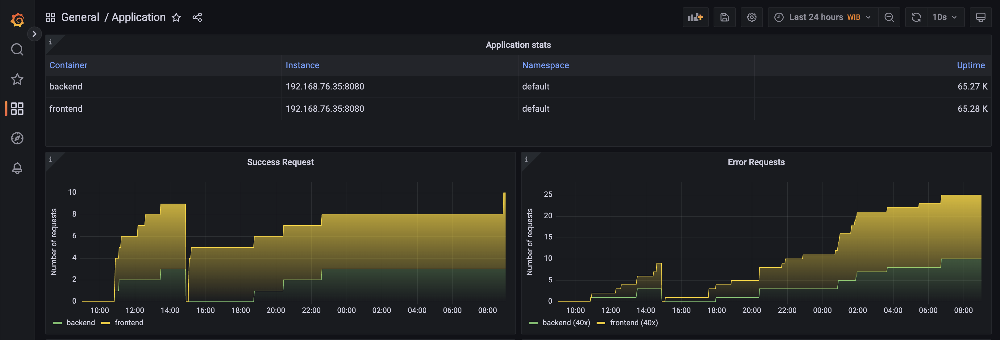
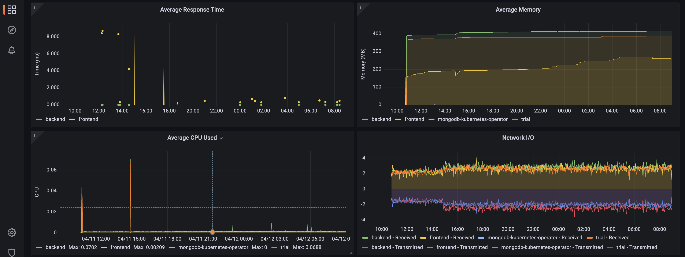

## Main steps

1. Deploy and setting up Observability (Helm 3.x, Grafana, Prometheus, Jaeger, Cluster Wide Jaeger).
2. Deploy a sample application in Kubernetes cluster.
3. Document the project in a README.

## Verify the monitoring installation


## Setup the Jaeger and Prometheus source


## Create a basic dashboard


## Describe SLO/SLI

Our SLOs for *monthly uptime* and *request response time* :
1. 99.99% uptime in the year.
2. 95% of requests completed in < 100 ms.

and we describe SLIs as below :
1. We got 99.98% uptime in the current year.
2. 94% of the requests were completed in < 100 ms.

## Creating SLI metrics

1. **Number of error response** - This metric can help us to identify what are the error and focus to fix on the error coming.
2. **Average response time** - This metric can help us to monitor latency of the application and also can help to do tuning to improve the application performance.
3. **Average time to recover if system down** - This metric can help us to measure our capacity to recover possible failovers.
4. **Total uptime for particular services** - This metric can help us to measure the health of our services and if any restart/self healing that happen.
5. **Average percentage of memory or CPU used by a service** - This metric can help us to measure the impact of our services and monitor the utilization and do preventation before reach heap.

## Create a dashboard to measure our SLIs


## Tracing our Flask app


## Jaeger in dashboards


## Report error

```markdown
**TROUBLE TICKET**

**Name**: Lutfi Ichsan
**Date**: 04/12/2023 9:20:10 AM
**Subject**: Error 40x showing up in backend and frontend services
**Affected Area**: API requests
**Severity**: High

**Description**:
it might be caused by path that not defined/available.
```

## Creating SLIs and SLOs

SLIs :
1. Error response not appear more than 10 in the last 24 hours.
2. Average response time < 2s/2000ms / minute.
3. Successful response > 75% more than errors coming.
4. 99% responses from application services is serving and valid data format.

SLO :
1. 99.9% uptime per month.
2. 99.9% of responses to our frontend service will return 2xx, 3xx or 4xx HTTP code within 2000 ms.
3. 99.99% of transaction requests will succeed for every month.
4. 99.9% of backend service requests will succeed on their first attempt.

## Building KPIs for our plan

1. Error response not appear more than 10 in the last 24 hours.
    + Successful requests / minute: indicates our system is going well or not.
    + Error requests per minute: indicates our system if any error coming.
    + Uptime - indicates if errors are comming from downtime or not.
2. Average response time < 2s/2000ms / minute.
    + Average response time:  will show average response time for services.
    + Uptime - help to determine if response time is affected by downtime of a service.
3. Successful response > 75% more than errors coming.
    + Successful requests per minute: indicates the number of successful request.
    + Error requests per minute: indicates the number of error requests.

## Final dashboard




+ Application stats panel - Shows information about the application services.
+ Successful requests - Shows the total number of successful requests per service.
+ Error requests - Shows the total number of 40x and 50x error requests per service.
+ Average response time - Shows the average response time successful requests (status 200) per service.
+ Average memory used - Shows the average memory used by each service.
+ Average CPU used  - Shows the average CPU used by each service.
+ Network I/O - Shows the amount of I/O operations per minute in the node.
+ Traces - Shows tracing services in Jaeger.